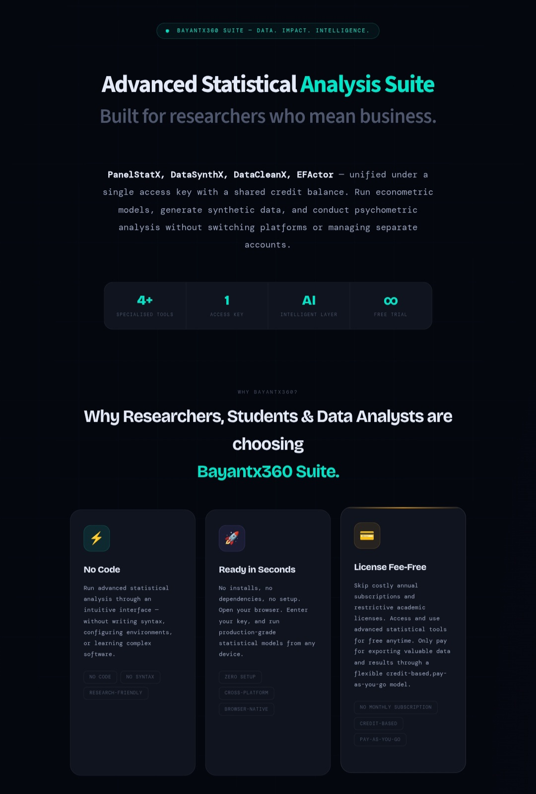

#  360-Suite: A No Code Modular System for Robust Statistical Data Analysis

  

360-Suite is the fastest way to generate data, clean it, diagnose and fix EFA issues,  run advanced regression models without code

## The Problem

In research and data analysis, researchers and students struggle with a lot of problems that are deeply rooted in system limitations, technical complexity as well as cost barriers. These are
- There is no current tools to generate custom quantitative datasets
- Current tools like Excel, SPSS and Stata cannot automatically clean messy data
- Expensive license cost make tools like Stata inaccessible to anyone to run advanced statistical models like panel regression
- Steep learning curve (R, Python) creates technical complexity for those with digital basic skills
- Time-consuming workflows

## The Solution

360-Suite solve these limitation and problems that comes with Stata, R and Python. It is built as a modular no-code statistical analysis system that let users run analysis with:
- 📵 No software installation
- 🚫 No payment of monthly/yearly license fee
- 🚫 No writing of code syntax.

Benefits of Using 360-Suite
- 🕧 Reduces analysis time by ~80%
- 💸 Eliminates need for paid software
- 🎓 User-friendly and can be used by anyone with basic digital skill
- 🔁 Can be accessed anywhere and used to run analysis via mobile phone and laptop devices

> Use Case:360-Suite provides a practical alternative to tools like Stata and R by enabling economists, researchers, students, and data analysts to generate custom dataset, clean messy data, fix psychometric issues, perform advanced panel data analysis without complex coding or expensive licenses. It streamlines workflows, helping users complete analysis faster and more efficiently.

---

## Key Features
⚙️ Core Engines

The system is designed and equipped with four statisical analysis engines:
-	🧹 DataCleanX for cleaning messy research data
-	🧬 DataSynthX for generating custom dataset that mirror the original (e.g a low response survey data)
-	🔍 EFActor for diagnosing and fixing Exploratory Factor Analysis (EFA) and running Confirmatory Factor Analysis (CFA)
-	📈 PanelStatX for running panel regression with different 5 estimators:
    -  Pooled OLS
    -  Fixed Effects
    -  Fixed Effects (Two-Way)
    -  Random Effects (GLS)
    -  First Difference.

🧠 Intelligent and Support Engines: 

- 🧠 AI-Powered Interpretation: statitical engines including DataSynthX and PanelStatX have a large language model powered intelligent layer that analyse, interprete, and write statistical report in human understandable lamguage
- 📊 Visualisation: All chart have intuitive charts that profile data features and provide understandable insights
- 📥 Data Export: Export of data (CSV/Excel) and result write up (docx) is enabled across all tools

---
## Workflow
360-Suite is very easy and direct to use by anyone under 3 minutes
1. 🌐 Visit the app here: [Bayantx360-Suite](https://bayantx360-suite.streamlit.app/)
2. ⚡️ Use free version or 🔑Enter Access Key (to use all product features)
3. ↗️ Select a statistical tool (Datasynth, PanelStatX, EFACtor, DataCleanX) to work with
4. 📂 Upload your panel dataset (CSV or excel file) in the side bar/main interface
5. ⚙️ Configure the system and run analysis in the sidebar
6. 🔍 View Results and Explore (use AI-Explainer where applicable)
7. 📥 Export Data/Result
> Note: Access key🔑 is required to be able to:
  - Use the AI-powered explainer feature
  - Download of analysis report. Without access key, these features are not permitted but analysis will run.

--- 
👉 Star this repo if you find it useful

